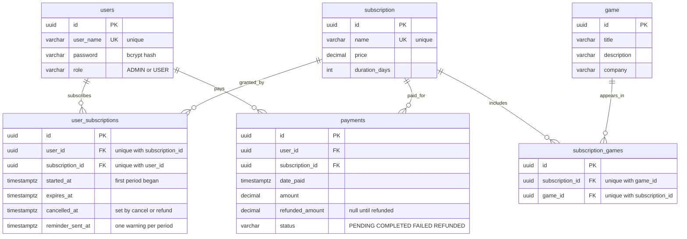

# Game Renting Store

A subscription video-game rental backend in Spring Boot 4 — users pick a tier, that tier
grants access to a catalogue of games, and payment is handled as part of subscribing.

Built as a learning project with the explicit goal of looking like production-shaped code
rather than tutorial-shaped code. Most of what is interesting here is in the decisions
below and in the [tests](#testing).

```
┌─────────────┐
│  HTTP Basic │  two roles: ADMIN, USER
└──────┬──────┘
       ▼
┌──────────────────────────────────────────────┐
│ Controller        request → DTO, DTO → page   │
├──────────────────────────────────────────────┤
│ Service           rules, @Transactional,     │
│                   ownership checks           │
├──────────────────────────────────────────────┤
│ Repository        Spring Data derived queries│
└──────┬───────────────────────────────┬───────┘
       ▼                               ▼
┌──────────────┐            ┌───────────────────────┐
│   Postgres   │            │ ExpiryReminderJob     │
│   17         │            │ @Scheduled, once-only │
└──────────────┘            └───────────────────────┘
```

## Highlights

**Subscribe and pay are one transaction.** `POST /user-subscription` creates the
subscription and its payment together, so an active subscription can never exist without
money behind it. There is deliberately no `POST /payment` — a payment with no
subscription behind it is just a number someone typed.

**Money is checked, then discarded.** The client sends `amount`; the server rejects the
request if it disagrees with `Subscription.price` and then stores the tier's own price.
Trusting the client's number would mean a €9.99 tier is available for €0.01.

**Refunding takes the access with it.** Money going back while access stays on are two
facts that should never disagree, so a refund cancels the subscription in the same
transaction. Cancel *does* prorate, which is safe in a way a full refund is not — you get
back only the fraction of the period you never used:

```
30 day tier at 9.99, cancelled 15 days in  →  4.99 back, 5.00 kept
30 day tier at 9.99, cancelled after expiry →  0.00 back
```

Proration measures backwards from `expiresAt`, not forwards from `startedAt`. After two
renewals those are 90 days apart while the latest payment only ever covered 30, so the
obvious implementation refunds three times too much.

**Payments have a state machine.** `PENDING → COMPLETED | FAILED`, `COMPLETED → REFUNDED`,
with `FAILED` and `REFUNDED` terminal. Illegal moves are `400`s, not silent writes.

**No IDOR.** Own-data routes are `/payment/me` and `/user-subscription/me`, with the user
id read off the security context via `@AuthenticationPrincipal`. There is no
`GET /payment/user/{userId}` to tamper with. Where a route must carry a row id — cancel —
the ownership check lives in the service, because no `requestMatchers` pattern can express
"the caller owns this id".

**Admin is unreachable over HTTP.** Registration hardcodes `USER` and the DTO has no role
field; there is no `PUT`/`PATCH`/`DELETE` on `/user/{id}`, so not even an admin can
promote anyone. `role` is `NOT NULL DEFAULT 'USER'` at the database level too.

**Renewal is locked.** Renewal reads `expiresAt`, adds a period, writes it back. Without
`PESSIMISTIC_WRITE`, two concurrent renewals both read the same value and the second write
discards the first — the customer pays twice and receives one period.

**Closing a subscription revives it rather than adding a row.** A unique constraint on
`(user_id, subscription_id)` means one row per user per tier, so cancelling without
resurrection would have turned a refund into a permanent lockout of that tier.

## Data model



Junction tables are entities with their own surrogate key plus a unique constraint on the
pair, not composite keys — so the join row can carry its own data, which
`user_subscriptions` already does with four timestamps.

## Stack

Java 21 · Spring Boot 4.1 · Spring Web MVC · Spring Data JPA (Hibernate 7) · Spring
Security · Bean Validation · Jackson 3 · Postgres 17 · H2 for tests · Docker ·
Lombok · JUnit 5 + Mockito

## Running it

```bash
docker compose up --build     # postgres + app on :8080
./mvnw test                   # 142 tests, no database needed
```

Or point it at your own Postgres and run `./mvnw spring-boot:run`.

Admin is created by SQL, never by the API:

```bash
docker compose exec db psql -U keni -d game_renting \
  -c "UPDATE users SET role='ADMIN' WHERE user_name='keni';"
```

## API

`?page=`, `?size=` (capped at 100) and `?sort=` work on every list endpoint.

| Method | Path | Who |
|---|---|---|
| `POST` | `/user` | anyone |
| `GET` | `/user/me` | own profile |
| `GET` | `/user`, `/user/{id}` | admin |
| `GET` | `/subscription` | any user |
| `POST` | `/subscription` | admin |
| `POST` | `/game` | admin |
| `POST` | `/subscription-game` | admin |
| `GET` | `/subscription-game/{...}` | any user |
| `POST` | `/user-subscription` | **subscribes self + pays** |
| `POST` | `/user-subscription/renew` | **renews self + pays** |
| `PATCH` | `/user-subscription/{id}/cancel` | owner or admin, prorates |
| `GET` | `/user-subscription/me` | own only |
| `GET` | `/user-subscription`, `/user-subscription/user/{id}` | admin, who bought what |
| `GET` | `/payment/me` | own only |
| `GET` | `/payment` | admin, every payment |
| `PATCH` | `/payment/{id}/status` | admin, `REFUNDED` also cancels |

List endpoints return an envelope, not a bare array:

```json
{"content":[…],"page":0,"size":20,"totalElements":25,"totalPages":2,
 "first":true,"last":false,"empty":false}
```

The size cap matters: page size is client-controlled, so without a bound
`?size=1000000` is a one-request denial of service. Spring Boot's own default is 2000.
